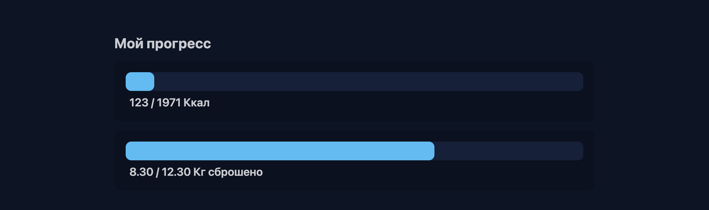
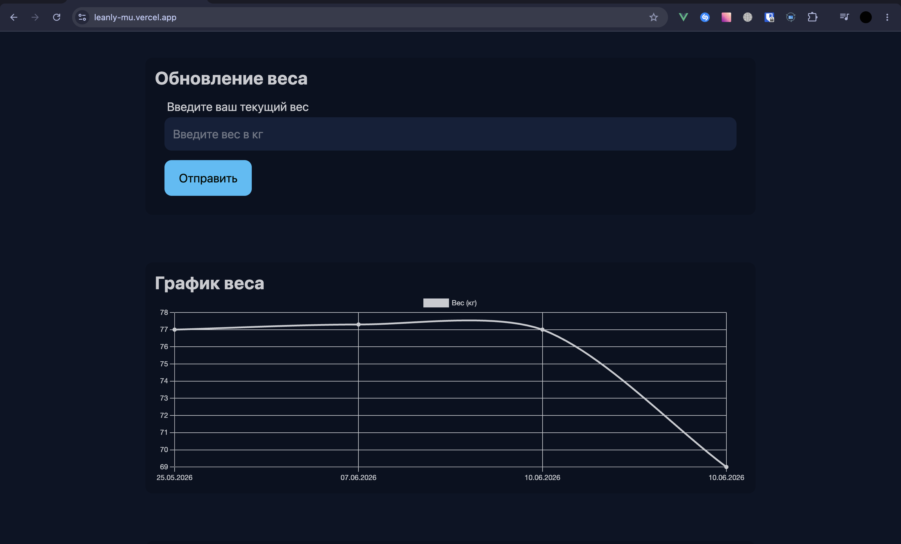
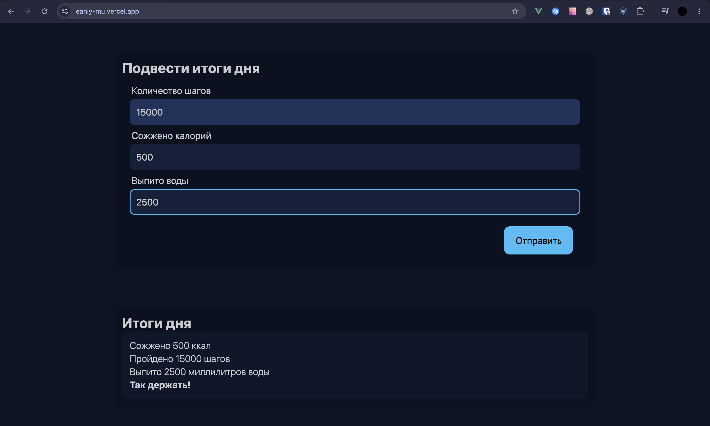
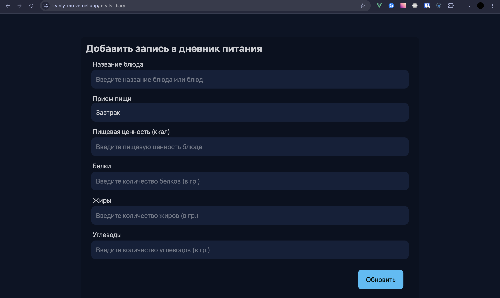
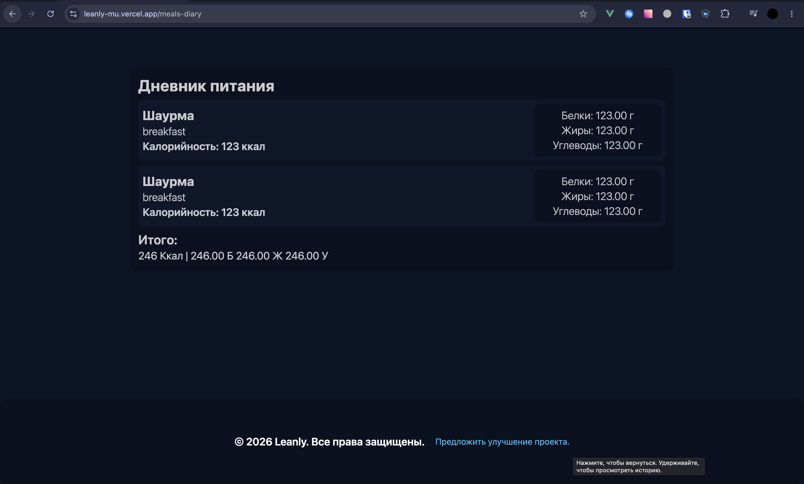
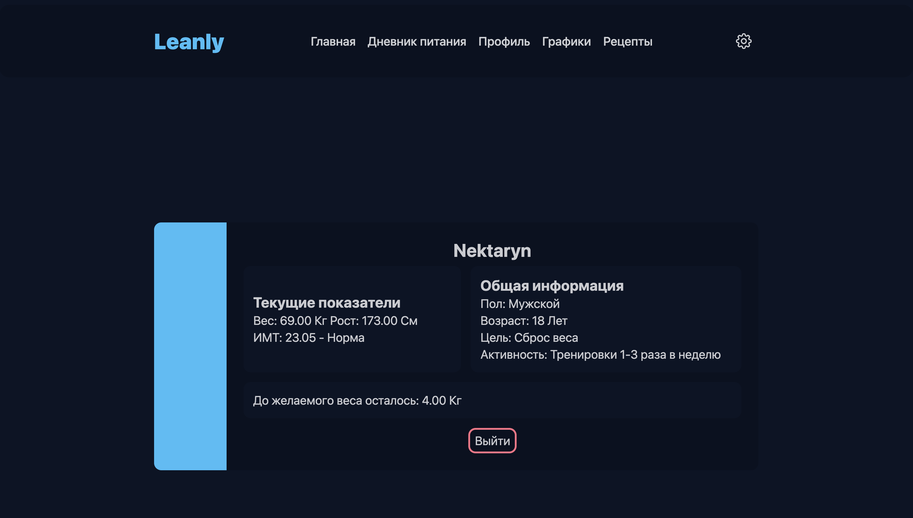
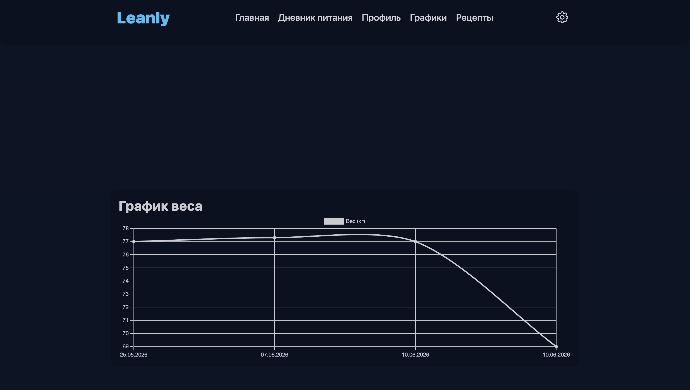

# Leanly - fitness web-app

Это full-stack веб-приложение для отслеживания тренировок, контроля питания и аналитики прогресса. Создано для тех, кто хочет структурировать свой путь к спортивным целям.

## Полезные ссылки

- Сайт: https://leanly-mu.vercel.app/
- Репозиторий бекенда: https://github.com/zularx/LeanlyBACKEND

## Основной функционал

### Дэшборд

Прогресс пользователя

Форма обновления веса и график

Форма итогов дня и сами итоги

### Дневник питания

Форма дневника питания

Сам дневник

### Профиль

Страница профиля пользователя

### Графики

График веса на странице графиков

